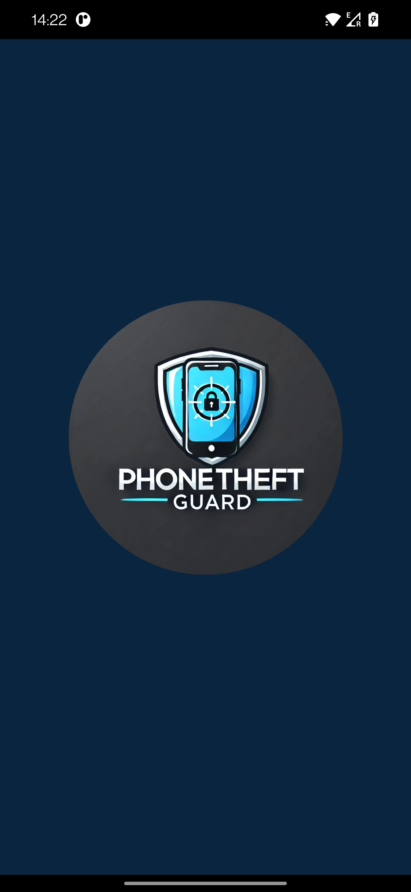
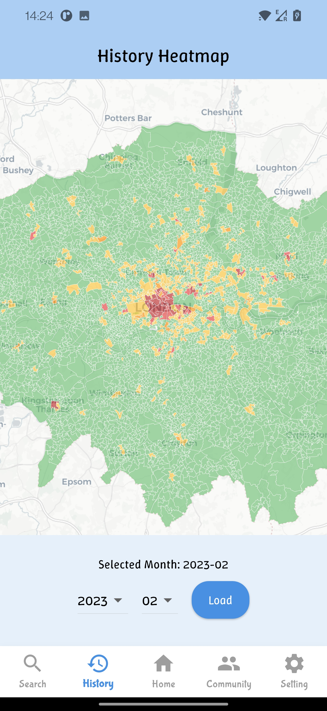
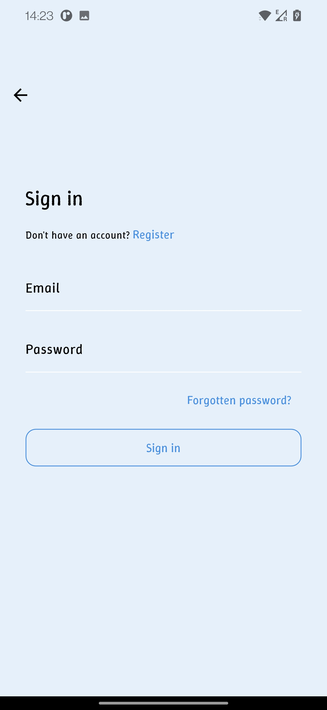
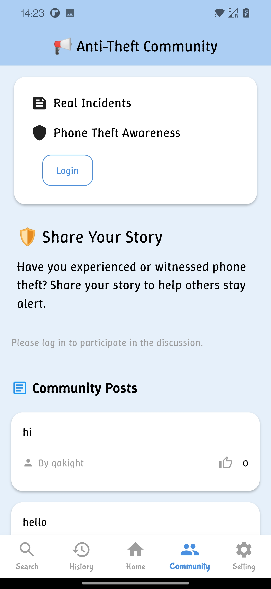
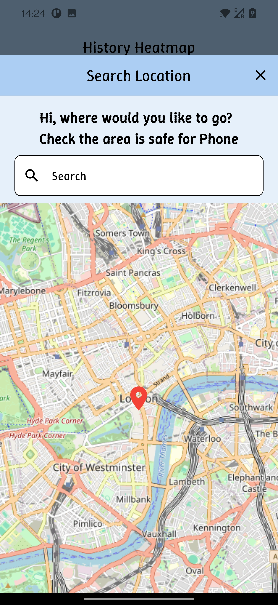
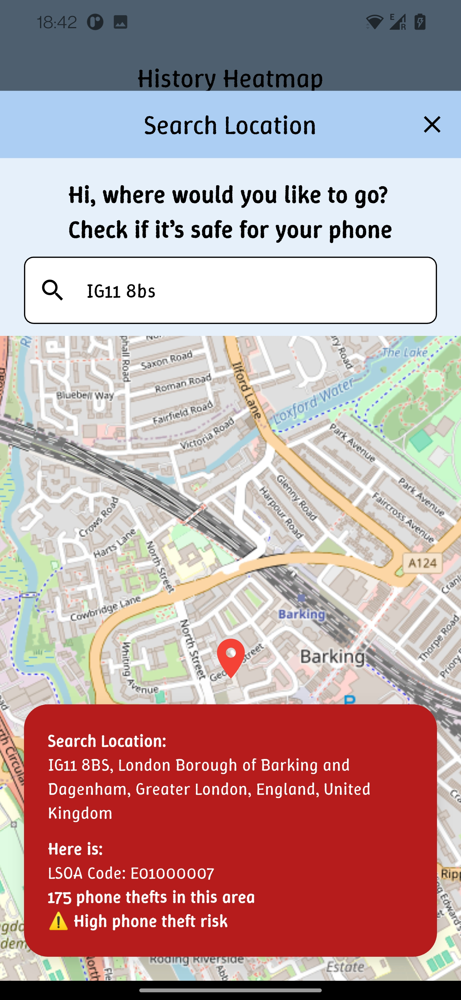
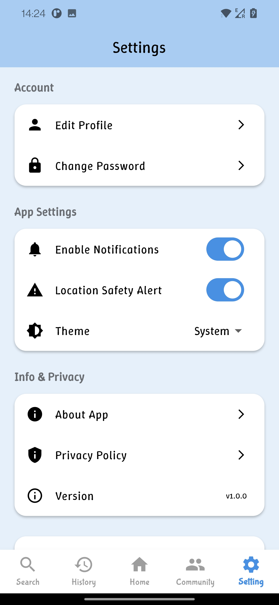
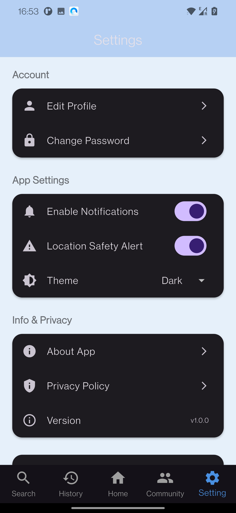

# 📱 Phone Theft Guard

Welcome to **Phone Theft Guard**, a mobile app developed for the final assessment of CASA0015! 🚀

**Phone Theft Guard** is designed to help users stay vigilant against phone theft in London. Using real-world crime data, the app visualizes theft hotspots on an interactive map and sends proactive alerts when users enter high-risk areas. Our goal is to empower city dwellers and tourists to move around safely with greater awareness.

---

## 📲 App Overview

- 🌍 **Interactive Map**: Visualize mobile theft hotspots across London.
- ⏰ **Real-time Alerts**: Receive warnings when entering high-risk zones.
- 🔀 **Timeline Slider**: Explore theft data trends month-by-month.
- 👤 **User Profile**: Manage your settings, preferences, and login via Firebase. 
- ⚙️ **Settings**:

  - Update your account information and reset your password.

  - Enable or disable real-time alerts and notifications.

  - Switch between Light and Dark themes for a personalized experience.

### Tech Stack & Frameworks Used:

- [Flutter](https://flutter.dev/) 👏
- [Firebase](https://firebase.google.com/) (Authentication, Firestore)
- [OpenStreetMap](https://www.openstreetmap.org/)
- [flutter_map](https://pub.dev/packages/flutter_map)
- [GeoJSON](https://geojson.org/)

### App Screenshots











### Presentation Video

[🎥 Watch the demo video here!](your-presentation-video-link) <!-- Replace with your video link -->

---

## 🔧 Installation Instructions

### 1. Requirements

Make sure you have the following installed:

- **Flutter** 3.16.0 or newer
- **Dart** 3.2.0 or newer
- **Android Studio** or **Xcode** (for running emulators)
- **Firebase CLI** configured (for authentication setup)

### 2. Installation Methods

#### Option 1: Build from Source

1. Clone the repository:

    ```bash
    git clone https://github.com/your-username/phone-theft-guard.git
    cd phone-theft-guard
    ```

2. Install dependencies:

    ```bash
    flutter pub get
    ```

3. Set up Firebase:

    - For **Android**: Add your `google-services.json` file into the `android/app/` directory.

4. Run the app:

    ```bash
    flutter build apk --release
    flutter install
    ```

#### Option 2: Download APK

- Download the latest APK release directly from the [Releases](https://github.com/mk20661/PhoneTheftGuard/releases) page.
- Install the APK on your Android device.
- Make sure \"Allow installation from unknown sources\" is enabled in your device settings.

> ⚠️ Note: Some features such as real-time alerts require location permissions.


## 📅 Plugins & Versions

- `firebase_core: ^2.25.4`
- `firebase_auth: ^4.17.4`
- `cloud_firestore: ^4.15.5`
- `flutter_map: ^6.0.1`
- `location: ^5.0.0`
- `flutter_local_notifications: ^16.3.1`
- `intl: ^0.19.0`

*(Check `pubspec.yaml` for the full list)*

---

## 📜 License

This project is licensed under the MIT License. See the [LICENSE](LICENSE) file for details.

---

## 📣 Contact Details

Developed by: **Hongbing Qiu**  
Email: qakightbing@163.com 
GitHub: [mk20661](https://github.com/mk20661)

Feel free to reach out if you want to collaborate, ask questions, or simply share your feedback! 😄

---

# Stay Safe, Stay Aware! 🚛📱

